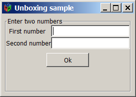
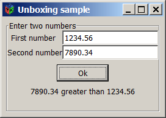
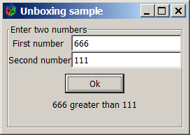
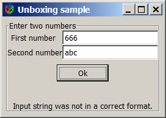

# Entendiendo Unboxing en C# con GTK#

Es la operación en donde un tipo por referencia se convierte a un tipo simple se denomina <b>Unboxing</b>, esta conversión al igual que el <b>Boxing</b> puede ser explícita o implícita según se requiera.

A diferencia del <b>Boxing</b> el <b>Unboxing</b> requiere muchos menos recursos ya que no requiere la reserva de memoria adicional porque solamente se obtiene un apuntador hacia el tipo simple contenido dentro del objeto.

Internamente el proceso de Unboxing lleva los siguientes pasos:
<ol>
<li>Se comprueba si existe una referencia hacia un objeto creado mediante Boxing.</li>
<li>Si esto es verdadero se obtiene un apuntador para el tipo simple contenido dentro del objeto.</li>
<li>Se le copia el valor del objeto al tipo simple también se copian los campos del objeto del managed heap al stack.</li>
<li>Si no existe una referencia al objeto se lanza una excepción del tipo NullReferenceException.</li>
<li>Si el tipo simple a la que se le asigna el valor del objeto no tiene la suficiente longitud para almacenar el valor del objeto se lanza una excepción del tipo <i>InvalidCastException</i>.</li>
</ol>

Como ejemplo del uso de esta técnica el siguiente programa GTK# solicita dos números de doble precisión y determina cuál es el mayor de ellos.

Al ejecutar el programa se muestra la siguiente ventana:

 

Al ingresar ambos valores y pulsar el botón <i>"Ok"</i> el programa comparará ambos números.

 

 

En el metódo <i>HandleBtnOkClicked</i> se encuentra toda la funcionalidad, es aquí donde utilizamos la técnica de <b>Unboxing</b>

<pre>
void HandleBtnOkClicked (object sender, EventArgs e)
{
 lblError.Text = string.Empty;
 try
 {
 double x,y,temp;
 x = Double.Parse (txtNumber1.Text);//Unboxing string to double
 y = Convert.ToDouble(txtNumber2.Text);//Unboxing 
 if(y > x)
 {
  temp = x;
  x = y;
  y = temp;
 }
 lblMsg.Text = x.ToString() + " greater than " + y.ToString();//Boxing
}catch(FormatException ex){
 lblMsg.Text = string.Empty;
 lblError.Text = ex.Message;    
}
}
</pre>

En la siguientes líneas, de un tipo por referencia como 
la propiedad <i>Text</i> del <i>Widget Entry</i>, lo convertimos a un tipo por valor:

<pre>
 double x,y,temp;
 x = Double.Parse (txtNumber1.Text);//Unboxing string to double
 y = Convert.ToDouble(txtNumber2.Text);//Unboxing 
</pre>

Es una buena práctica utilizar el código que realiza el <b>Unboxing</b> dentro de un bloque <i>try/catch</i>, esto para
manejar la excepción en caso de que el valor del tipo por referencia (objeto) no sea del mismo tipo que el tipo simple que lo almacenará.

 
